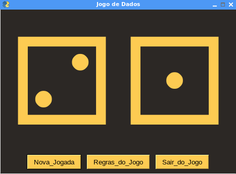

# Dice-Roller

# Sobre o Software:

* Este software é um jogo com dois dados feito inteiramente em python e usa as biblioteca PySimpleGui e Random.
* O PySimpleGui é usado para criar a interface gráfica...

# Download do Dice-Roller
* Baixe a pasta manualmente ou use o comando [git clone https://github.com/elizeubarbosaabreu/Dice-Roller.git] para criar um clone deste projeto...

# Instalação das Dependências:

* O Python dependerá de algumas bibliotecas para poder funcionar bem com esta aplicação...
* Instale as dependencias com o comando abaixo:
* [pip install -r requirements.txt]
* Se você estiver usando Linux ou Mac, talvez o comando [pip3 install -r requirements.txt], funcione melhor...

# Máquina Virtual
* Se você tem um pouco mais de experiência com programação, sugiro que crie uma máquina virtual para instalar as bibliotecas usadas aqui. Isso vai evitar conflitos em versões de softwares futuramente.

Use o Pycharm, Thonny, Vs Studio ou outra IDE python para rodar o arquivo 'App.py'...

Você também pode usar o <a href="https://www.pyinstaller.org/">pyinstaller</a> para criar um executável para o software...

# Divirta-se à vontade...
